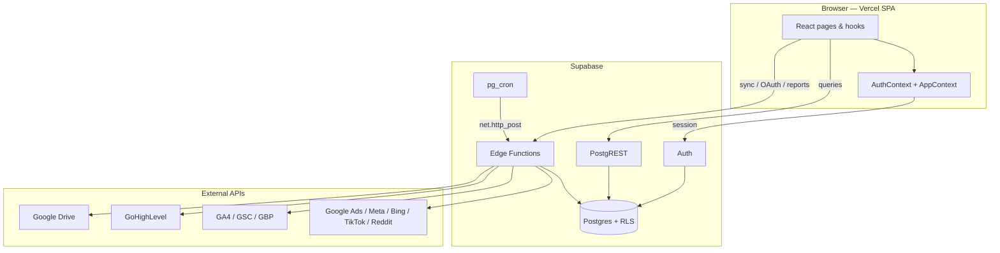
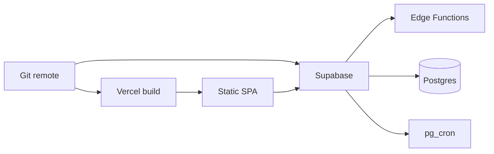

# Agency Dashboard

<!-- Badges: replace with your CI / deploy / license badges when available -->


Multi-tenant **marketing analytics and reporting** platform for agencies: connect ad and analytics platforms, sync performance data, enforce role-based access, and export client-ready PPTX/PDF reports—with white-label branding per agency.

> **npm package name:** `wow-dashboard` · **UI default branding:** Chipper Digital (overridable per agency)

---

## Table of contents

- [Screenshots](#screenshots)
- [Overview](#overview)
- [Features](#features)
- [Architecture](#architecture)
- [Tech stack](#tech-stack)
- [Repository structure](#repository-structure)
- [Getting started](#getting-started)
- [Environment variables](#environment-variables)
- [Available scripts](#available-scripts)
- [Authentication and authorization](#authentication-and-authorization)
- [Integrations](#integrations)
- [Edge Functions API](#edge-functions-api)
- [Database](#database)
- [Deployment](#deployment)
- [Operations notes](#operations-notes)
- [Development](#development)
- [Documentation index](#documentation-index)
- [License](#license)

---

## Screenshots

<!-- Replace paths with real screenshots under docs/ or public/ when available -->

| Combined dashboard | Platform report | Monthly / PPT export |
| :---: | :---: | :---: |
|  |  |  |

| Settings / sync | Admin | Login |
| :---: | :---: | :---: |
|  |  |  |

---

## Overview

Agency Dashboard is a **Vite + React SPA** backed by **Supabase** (Auth, Postgres, Edge Functions, cron) and hosted on **Vercel**. It is **not** a Next.js application.

Agencies use it to:

- Unify paid media and analytics reporting in one permissioned UI  
- Connect platforms via OAuth (or tokens) and sync metrics into Postgres  
- Produce monthly and PowerPoint-style client deliverables  
- White-label the experience per agency (colors, logo, naming)

**Who it’s for:** agency admins, account managers, leadership, super admins operating multiple tenants, and engineers who deploy the SPA and Supabase project.

---

## Features

### Implemented

| Area | Capability |
| --- | --- |
| **Dashboard** | Combined / executive view across Google Ads, Meta, Bing, TikTok, Reddit, and GA4 with date compare |
| **Paid media** | Dedicated pages for Google Ads, Meta Ads, Bing / Microsoft Ads, TikTok Ads, Reddit Ads |
| **Analytics / CRM** | GA4 (plus agency-specific advanced VDP mode), GHL Leads (calls/forms/chat; HIPAA CSV path) |
| **Reports** | Agency Reports (Google Ads geo & search terms), Monthly Reports editor, PPT Report builder |
| **Exports** | PDF and PPTX generation; optional Google Drive / Slides upload |
| **SEO in monthly decks** | GSC / GBP / GA4 via `marketing-report-realtime` (+ DB fallbacks) |
| **Settings** | White-label branding; platform connect; chunked manual sync + `sync_log` |
| **Admin** | Users, roles, clients, permissions sync; agencies (super admin); agency switcher |
| **Security model** | Supabase Auth, RBAC permission keys, account allowlisting, Postgres RLS helpers |

### Placeholder navigation (not implemented)

These appear as “Coming soon” stubs only: DSP, Dating Apps, CTV, Email, OTT/Vimeo, standalone SEO page, Creative Analysis, Events.

### Not in this codebase

- Next.js App Router / Server Components / `middleware.ts`  
- Custom Express/Node API server  
- Inbound webhooks  
- Automated test suite, ESLint/Prettier, GitHub Actions CI  

---

## Architecture



**Typical data flow**

1. Admin connects a platform in Settings → `*-oauth-connect` stores credentials.  
2. Manual or scheduled sync → `*-full-sync` / related functions upsert metrics.  
3. Pages/hooks read scoped rows via PostgREST.  
4. Report builders aggregate DB (+ optional live Edge calls) and export in the browser.

Deep dive: [`docs/readme-work/06-architecture.md`](docs/readme-work/06-architecture.md)

---

## Tech stack

| Layer | Technology |
| --- | --- |
| UI | React 18, react-router-dom 7 |
| Build | Vite 5 |
| Backend | Supabase Auth, Postgres, Edge Functions (Deno), pg_cron |
| Client SDK | `@supabase/supabase-js` |
| Charts | Chart.js, Recharts |
| Export | jsPDF, html2canvas, PptxGenJS, Papa Parse |
| Hosting | Vercel (`vercel.json` SPA rewrites) |

---

## Repository structure

```text
├── src/                      # React application
│   ├── pages/                # Feature screens
│   ├── components/           # Shared UI, gates, previews
│   ├── hooks/                # Data hooks (use*Data)
│   ├── context/              # Auth + app chrome
│   ├── lib/                  # Supabase clients, REST pagination
│   ├── utils/                # Sync, exports, SEO/HIPAA helpers
│   └── config/               # Nav + permission catalog
├── supabase/
│   ├── functions/            # Edge Functions (one folder each)
│   ├── migrations/           # SQL migrations
│   ├── Cron-jobs.json        # Intended pg_cron jobs
│   └── full_schema.sql       # Schema dump (reference)
├── public/                   # Static logos
├── scripts/                  # Ops helpers (backfill, inspect)
├── docs/readme-work/         # Extended documentation drafts
├── package.json
├── vite.config.js
├── vercel.json
└── .env.example
```

Full map: [`docs/readme-work/repository-map.md`](docs/readme-work/repository-map.md)

---

## Getting started

### Prerequisites

- Node.js (LTS recommended; no `engines` field pinned)
- npm
- A Supabase project (Auth + schema; Edge Functions for sync/OAuth)

### Install and run

```bash
git clone <repository-url>
cd new-agency-dashboard
npm install
cp .env.example .env
```

Edit `.env` with your Supabase **Project URL** and **anon key**, then:

```bash
npm run dev
```

Open [http://localhost:5173](http://localhost:5173) (Vite default).

> Users need a Supabase Auth account **and** a `user_profiles` row (agency + role) for normal access. Use Admin to provision users, or rely on Auth triggers if configured in your project.

---

## Environment variables

### Frontend (Vite `.env`)

| Variable | Required | Description |
| --- | --- | --- |
| `VITE_SUPABASE_URL` | Yes | Supabase project URL |
| `VITE_SUPABASE_ANON_KEY` | Yes | Supabase anon (public) key |
| `VITE_APP_NAME` | No | Login title (default: `Agency Dashboard`) |
| `VITE_AUTH_DISABLED` | No | Demo bypass — **never enable in production** |
| `VITE_GOOGLE_CLIENT_ID` | For Drive export | Google OAuth Web client ID |
| `VITE_GA4_CLIENT_ID` | Optional | Fallback if Google client ID unset |
| `VITE_GOOGLE_DRIVE_REPORTS_FOLDER_ID` | No | Shared Drive folder for uploads |

### Edge Function secrets (Supabase)

Set in the Supabase project (not as `VITE_*`). Names used in code include:

`SUPABASE_URL`, `SUPABASE_SERVICE_ROLE_KEY`, `SUPABASE_ANON_KEY`, `GADS_CLIENT_ID`, `GADS_CLIENT_SECRET`, `GADS_DEVELOPER_TOKEN`, `GA4_CLIENT_ID`, `GA4_CLIENT_SECRET`, `FB_APP_ID`, `FB_APP_SECRET`, `REDDIT_CLIENT_ID`, `REDDIT_CLIENT_SECRET`, `REDDIT_REDIRECT_URI`, `TIKTOK_APP_ID` / `TIKTOK_APP_SECRET` (or `TIKTOK_CLIENT_*`), `BING_CLIENT_ID`, `BING_CLIENT_SECRET`, `BING_DEVELOPER_TOKEN`, `BING_TENANT`, `GOOGLE_DRIVE_REPORTS_FOLDER_ID`

Cron HTTP jobs also expect Vault secrets named `project_url` and `anon_key`.

**Security:** Do not commit real secrets. Prefer ignoring `.env` in git (`.env` is not currently listed in `.gitignore`—treat that as a hardening item).

Full tables: [`docs/readme-work/02-installation.md`](docs/readme-work/02-installation.md)

---

## Available scripts

| Command | Description |
| --- | --- |
| `npm run dev` | Vite development server |
| `npm run build` | Production build → `dist/` |
| `npm run preview` | Preview the production build |

No `lint`, `test`, or `typecheck` scripts are defined.

---

## Authentication and authorization

| Concern | Implementation |
| --- | --- |
| Login / signup | Supabase Auth (`/login`, `/signup`) |
| Session | `AuthContext` + persisted Supabase session |
| Route protection | `ProtectedRoute` on `/`, `/admin`, `/ppt-report` |
| Permissions | `role_permissions` → `hasPermission`; Sidebar / `PermissionGate` |
| Account scope | `user_clients` + `client_platform_accounts` (or view-all roles/permissions) |
| Super admin | Multi-agency switcher; Agencies admin tab |
| DB enforcement | RLS + helpers such as `can_access_customer` |

Platform marketing OAuth (`/oauth/callback`) is **separate** from user login.

---

## Integrations

| Platform | Connect | Sync / data | UI |
| --- | --- | --- | --- |
| Google Ads | `oauth-connect` | `gads-full-sync`, `gads-status-geo`, `gads-geo-resolve` | Google Ads + Agency Reports |
| Meta Ads | `fb-oauth-connect` | `fb-full-sync` | Meta Ads page |
| Bing / Microsoft | `bing-oauth-connect` | `bing-full-sync` (+ cron) | Bing page |
| TikTok | `tiktok-oauth-connect` | `tiktok-full-sync` | TikTok page |
| Reddit | `reddit-oauth-connect` | `reddit-full-sync` | Reddit page |
| GA4 | `ga4-oauth-connect` | `ga4-sync`, `ga4-realtime-users` | GA4 page |
| GoHighLevel | Location API key / PIT | `ghl-sync` (skipped if HIPAA flag) | GHL Leads |
| GSC / GBP | Via Google OAuth + CPA | `marketing-report-realtime` / DB | Monthly SEO slides |
| Hoot inventory | Feeds on clients | `hoot-inventory-sync` | Backend sync |
| Google Drive | Browser OAuth and/or Edge | Upload helpers | Monthly export |

**Ingestion model:** pull-based sync (manual + cron). No inbound webhooks.

---

## Edge Functions API

Base URL:

```text
{SUPABASE_URL}/functions/v1/{function-name}
```

All custom HTTP APIs are **Supabase Edge Functions** (POST + CORS OPTIONS on most). There are **19** functions covering OAuth, sync, reports, and Drive upload.

| Group | Functions |
| --- | --- |
| OAuth | `oauth-connect`, `ga4-oauth-connect`, `fb-oauth-connect`, `reddit-oauth-connect`, `tiktok-oauth-connect`, `bing-oauth-connect` |
| Google Ads ops | `gads-full-sync`, `gads-status-geo`, `gads-geo-resolve` |
| Platform sync | `fb-full-sync`, `reddit-full-sync`, `tiktok-full-sync`, `bing-full-sync`, `ga4-sync`, `ghl-sync`, `hoot-inventory-sync` |
| Reports / utility | `ga4-realtime-users`, `marketing-report-realtime`, `google-drive-upload` |

Request/response contracts, auth rules, and examples: [`docs/readme-work/05-api.md`](docs/readme-work/05-api.md)

---

## Database

Postgres (Supabase) stores tenancy, credentials, synced metrics, and monthly report documents.

**Core relationship (simplified):**

```text
agencies
  ├── user_profiles → roles → role_permissions → permissions
  ├── clients → client_platform_accounts → agency_platform_credentials
  ├── user_clients → client_platform_accounts
  └── monthly_reports → accounts / sections / uploads

client_platform_accounts.platform_customer_id
  └── logical link → gads_* / fb_* / bing_* / tiktok_* / reddit_* / ga4_* / ghl_*
```

Schema dumps: `schema.sql`, `supabase/full_schema.sql` (may lag live DB).  
Detailed inventory (tables, RLS, functions, migrations): [`docs/readme-work/04-database.md`](docs/readme-work/04-database.md)

**Storage:** app uploads logos to bucket `agency-logos` (create in Supabase if missing).

---

## Deployment

### Frontend (Vercel)

| Setting | Value |
| --- | --- |
| Build | `npm run build` |
| Output | `dist` |
| Routing | SPA rewrite to `index.html` (`vercel.json`) |

Set the same `VITE_*` variables on Vercel. OAuth redirect URIs must include:

```text
https://<your-production-host>/oauth/callback
```

(A code fallback references `https://new-agency-dashboard.vercel.app/oauth/callback`.)

### Backend (Supabase)

1. Apply non-empty migrations under `supabase/migrations/`.  
2. Deploy Edge Functions.  
3. Configure Edge + Vault secrets.  
4. Enable cron jobs (see `supabase/Cron-jobs.json` — GAds daily jobs + Bing metrics).  
5. Ensure `agency-logos` storage bucket exists.



Ops checklists and production gaps: [`docs/readme-work/08-operations.md`](docs/readme-work/08-operations.md)

---

## Operations notes

| Topic | Status |
| --- | --- |
| Hosting pattern | Vercel SPA + Supabase — documented |
| CI/CD in repo | None (no GitHub Actions / Docker) |
| Error tracking (Sentry, etc.) | Not integrated |
| Logging | Browser console, Edge logs, `sync_log` |
| Backups | Use Supabase plan backups — not scripted here |
| Auth bypass in prod | Keep `VITE_AUTH_DISABLED` off |

**Intended cron (UTC)** from `Cron-jobs.json`: Bing metrics ~05:40; GAds status/geo/metrics 06:00–06:30; geo-resolve 07:00.

---

## Development

### Conventions (observed)

- Pages: `PascalCase` + `Page` (`GoogleAdsPage.jsx`)  
- Hooks: `use*Data.js`  
- Permissions: edit `src/config/platformConfig.js`, then Admin → **Sync Platform Config**  
- Nav: `src/config/navConfig.jsx` + `App.jsx` `CurrentPage`  
- Edge Functions: kebab-case folders under `supabase/functions/`

### Common tasks

| Task | Start here |
| --- | --- |
| New sidebar page | `navConfig.jsx` → page → `App.jsx` → sync permissions |
| New platform tab | `PLATFORM_REPORT_TABS` → Admin sync → page UI |
| Debug sync | Settings UI + Supabase Edge logs + `sync_log` |
| Debug empty data | CPA allowlists, agency switcher, date range, table freshness |

Developer guide: [`docs/readme-work/07-developer-guide.md`](docs/readme-work/07-developer-guide.md)

---

## Documentation index

Extended drafts used to assemble this README:

| Document | Contents |
| --- | --- |
| [`docs/readme-work/00-project-analysis.md`](docs/readme-work/00-project-analysis.md) | Full repository analysis |
| [`docs/readme-work/01-project-overview.md`](docs/readme-work/01-project-overview.md) | Product overview |
| [`docs/readme-work/02-installation.md`](docs/readme-work/02-installation.md) | Install & env |
| [`docs/readme-work/03-features.md`](docs/readme-work/03-features.md) | Feature catalog |
| [`docs/readme-work/04-database.md`](docs/readme-work/04-database.md) | Database reference |
| [`docs/readme-work/05-api.md`](docs/readme-work/05-api.md) | Edge Function API reference |
| [`docs/readme-work/06-architecture.md`](docs/readme-work/06-architecture.md) | Architecture |
| [`docs/readme-work/07-developer-guide.md`](docs/readme-work/07-developer-guide.md) | Developer guide |
| [`docs/readme-work/08-operations.md`](docs/readme-work/08-operations.md) | Operations |
| [`docs/readme-work/repository-map.md`](docs/readme-work/repository-map.md) | Directory map |
| [`docs/readme-work/final-review.md`](docs/readme-work/final-review.md) | Documentation review notes |

Prior README preserved as [`README_OLD.md`](README_OLD.md).

---

## License

Private project (`"private": true` in `package.json`). Confirm licensing and distribution terms with the repository owners before publishing or sharing.
