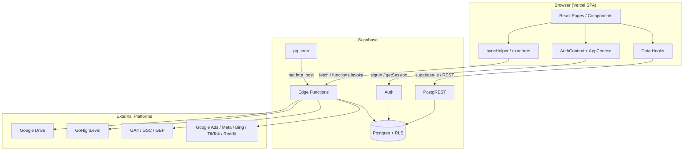
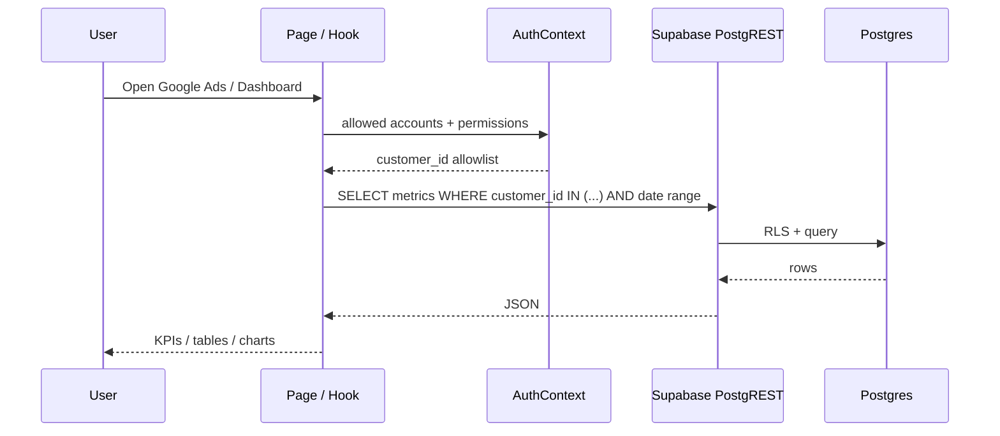
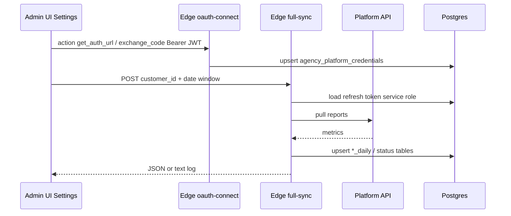
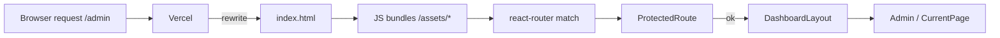
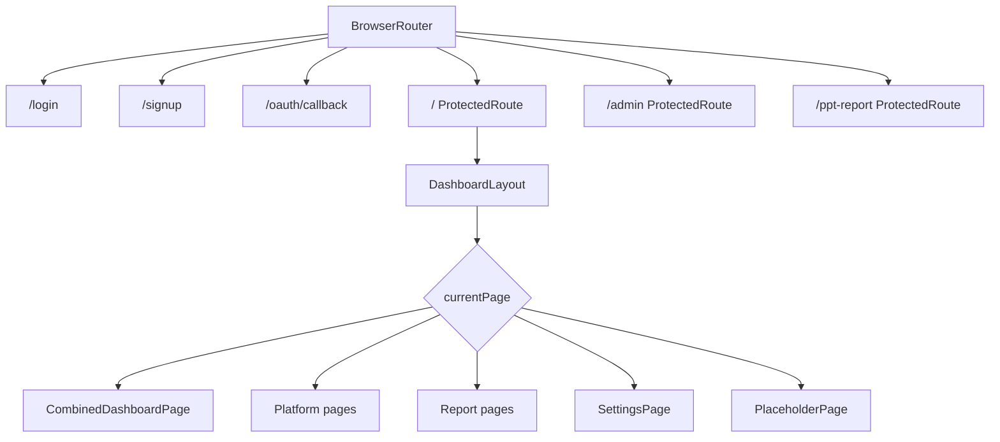
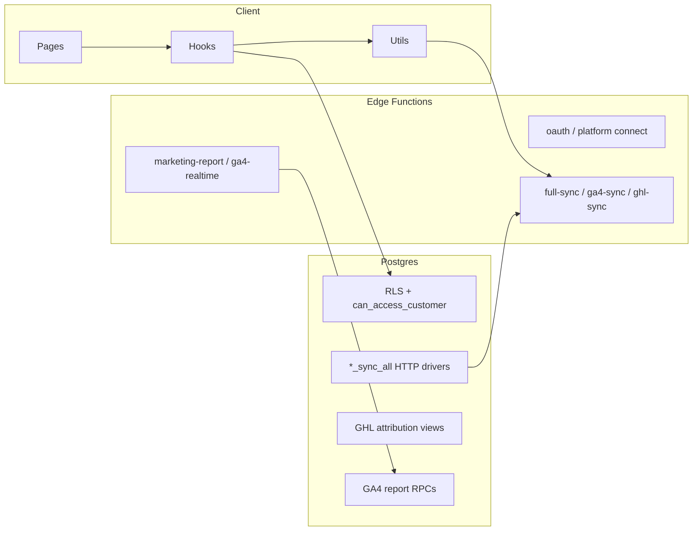
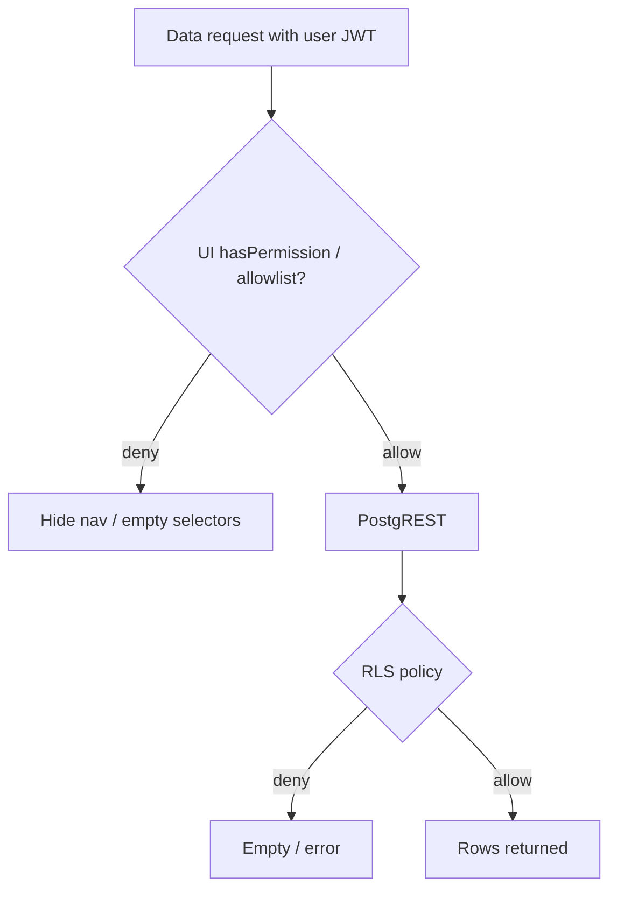
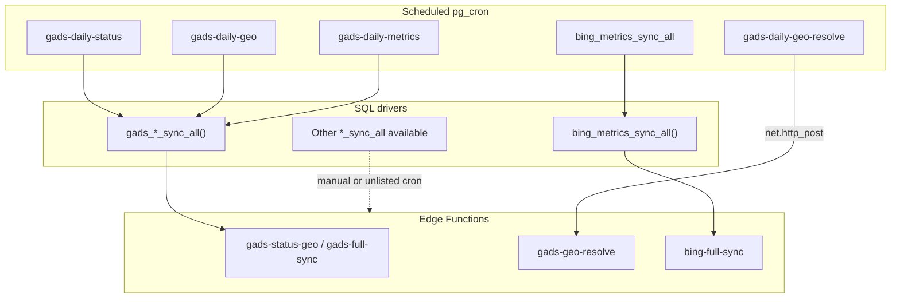
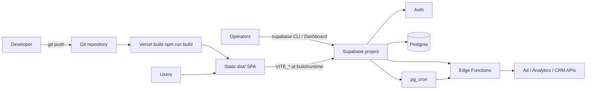

# Agency Dashboard — Architecture

> Architecture documentation based on the implemented Vite + React + Supabase stack.  
> This is **not** a Next.js App Router application; sections below map requested topics to **what actually exists**.  
> Does not modify the root `README.md`.

---

## Application Architecture

Agency Dashboard is a **browser SPA** with a **BaaS backend**:

| Tier | Technology | Responsibility |
|---|---|---|
| **Presentation** | React 18 + Vite 5 | UI, client-side routing, report export in-browser |
| **State / access control (client)** | React Context (`AuthContext`, `AppContext`) | Session, RBAC, agency scope, chrome state |
| **API gateway** | Supabase Auth + PostgREST | Login, CRUD/query over Postgres with RLS |
| **Compute** | Supabase Edge Functions (Deno) | OAuth connect, platform sync, realtime report helpers |
| **Data** | Postgres 17 (Supabase) | Tenancy, credentials, metrics, reports |
| **Scheduler** | `pg_cron` + `pg_net` + Vault | Daily sync orchestration |
| **Hosting** | Vercel (static SPA) | CDN assets + HTML rewrite to `index.html` |

There is **no** separate Node/Express server and **no** Next.js server runtime in this repository.



### Frontend module layout (logical)

```text
src/
  main.jsx          → providers + ErrorBoundary
  App.jsx           → react-router shell + page switcher
  pages/            → feature screens
  hooks/            → data loading per domain
  context/          → cross-cutting client state
  components/       → shared UI + gates
  lib/              → supabase clients, REST pagination, agency scope
  utils/            → sync, export, SEO/HIPAA helpers
  config/           → nav + permission catalog
```

This is a **feature-hook + context** organization, not a formal Clean Architecture folder tree.

---

## Data Flow

### A. Interactive dashboard read



### B. Platform connect + sync write



### C. Report generation

1. Monthly/PPT pages load accounts from `clients` / `client_platform_accounts`.  
2. Metrics come from Postgres hooks **and/or** live Edge calls (`marketing-report-realtime`, `ga4-realtime-users`).  
3. Browser builds PDF/PPTX (`jspdf`, `pptxgenjs`, `html2canvas`).  
4. Optional Drive upload via browser GIS OAuth or `google-drive-upload` Edge Function.

---

## Request Lifecycle

### SPA navigation request (Vercel)



1. Any path rewrites to `index.html` (`vercel.json`).  
2. Vite-built JS hydrates React.  
3. `BrowserRouter` matches `/`, `/login`, `/admin`, `/ppt-report`, `/oauth/callback`, etc.  
4. Most “pages” (Google Ads, Meta, …) are **not** separate URLs—they switch via `AppContext.currentPage` inside `/`.

### Data request lifecycle (PostgREST)

1. Hook builds filters from AuthContext + date picker.  
2. Call `supabase.from(...).select(...)` or `supabaseRest.sbFetchAllWithLimit`.  
3. Browser sends `apikey` + `Authorization: Bearer <access_token>`.  
4. PostgREST applies **RLS**; returns JSON.  
5. Hook aggregates into KPIs/tables; UI renders.

### Edge Function lifecycle

1. Browser/cron `POST /functions/v1/{name}` with CORS preflight when applicable.  
2. Gateway accepts JWT (project config).  
3. Function may `getUser` (OAuth/Drive) or run as service-role worker (sync).  
4. Function calls external APIs and/or PostgREST with **service role**.  
5. Returns JSON or text/plain log.

---

## Server Components

**Not applicable.**

This project does not use React Server Components or Next.js. All React components render in the **browser**. Server-side logic lives in:

- Supabase **Edge Functions** (Deno)
- Postgres **functions / views / RLS**
- Scheduled **SQL** (`*_sync_all`)

---

## Client Components

**Everything in `src/` is client-side React.**

| Layer | Examples | Role |
|---|---|---|
| Providers | `AuthProvider`, `AppProvider` | Global state |
| Shell | `Sidebar`, `Header`, `ProtectedRoute`, `PermissionGate` | Navigation + gates |
| Pages | `GoogleAdsPage`, `Admin`, `SettingsPage`, … | Features |
| Hooks | `useGoogleAdsData`, `useCombinedDashboardData`, … | Fetch + derive view models |
| Presentational | tables, KPI cards, slide previews | Display |

There is no `"use client"` directive pattern—the entire app is a CSR SPA.

---

## App Router

**Not applicable (no Next.js App Router).**

Routing is **react-router-dom v7** plus in-app page state:

| Mechanism | Routes / IDs |
|---|---|
| **URL routes** | `/`, `/login`, `/signup`, `/oauth/callback`, `/admin`, `/ppt-report`, `/dashboard`→`/` |
| **In-app page IDs** | `dashboard`, `google-ads`, `meta-ads`, `bing-ads`, `tiktok-ads`, `reddit-ads`, `ga4`, `ghl`, `agency-reports`, `monthly-reports`, `settings`, … |



---

## Middleware

**No `middleware.ts` / Next middleware.**

Equivalent cross-cutting behavior:

| Concern | Implementation |
|---|---|
| Auth gate | `ProtectedRoute` (session required) |
| Permission gate | `PermissionGate`, page checks, Sidebar filter |
| Admin gate | `action.manage_users` inside layout for `/admin` |
| CORS | Edge Function headers + OPTIONS handlers |
| Edge auth | `getUser(Bearer)` inside OAuth/Drive functions |
| Deploy cache | `vercel.json` Cache-Control headers |
| Stale chunk recovery | `vite:preloadError` → full reload in `main.jsx` |

---

## Repository Pattern

**Not implemented as a formal repository layer.**

Data access is **inline** in hooks, pages, and utils:

| Access style | Location | Example |
|---|---|---|
| Supabase query builder | Hooks / AuthContext / Admin | `supabase.from('gads_campaign_daily').select(...)` |
| Paginated REST helper | `src/lib/supabaseRest.js` | `sbFetchAllWithLimit`, `buildQuery` |
| Edge invoke / fetch | Settings, syncHelper, report utils | `functions/v1/gads-full-sync` |
| RPC | GA4 / credential helpers | `ga4_summary_report`, `get_platform_credential` |

There are **no** `repositories/` or `services/` packages. Closest abstractions:

- `supabaseRest.js` — transport/pagination helper  
- `syncHelper.js` — orchestration for chunked sync calls  
- Domain hooks — act as ad-hoc “use-case + data access” modules

---

## Service Layer

**No dedicated service layer folder.**

Business logic is distributed:



| Kind of logic | Where it lives |
|---|---|
| RBAC / agency scope | `AuthContext`, `agencyScope.js`, `platformConfig.js` |
| Metric aggregation | Per-platform hooks + page components |
| Sync chunking | `syncHelper.js`, Settings handlers |
| OAuth + ingestion | Edge Functions |
| Attribution cleaning | SQL views (`ghl_*_view`) |
| Export composition | `utils/generate*.ts`, monthly builders |

---

## Database Layer

Postgres is the system of record. Architectural roles:

| Concern | Mechanism |
|---|---|
| Tenancy | `agencies`, `user_profiles.agency_id`, CPA `agency_id` |
| Authorization (DB) | RLS policies + `can_access_customer` / `is_admin` / `is_super_admin` |
| Integration secrets | `agency_platform_credentials` (service role for sync) |
| Facts | `gads_*`, `fb_*`, `bing_*`, `tiktok_*`, `reddit_*`, `ga4_*`, `ghl_*`, … |
| Reports | `monthly_reports` (+ children) |
| Ops | `sync_log`, cleanup/orphan functions, sync-all drivers |

Logical join from UI → metrics is usually:

`user → permissions/accounts → platform_customer_id → *_daily.customer_id`

(often **without** FK from fact tables to CPA).

See `04-database.md` for full schema detail.

---

## Authentication Flow

```mermaid
sequenceDiagram
  participant U as User
  participant Login as Login.jsx
  participant AC as AuthContext
  participant SA as Supabase Auth
  participant DB as user_profiles / roles / CPA

  U->>Login: email + password
  Login->>AC: signIn()
  AC->>SA: signInWithPassword
  SA-->>AC: session + user
  AC->>DB: load profile, role_permissions, accounts
  DB-->>AC: RBAC + allowlists
  AC-->>U: isAuthenticated; redirect /

  Note over AC,SA: onAuthStateChange keeps session fresh
  Note over AC: Debounce / profileLoadedForUser avoids tab-focus re-fetch logout
```

Additional paths:

| Path | Behavior |
|---|---|
| Signup | `signUp` → may require email confirmation; profile often pending until Admin assigns agency/role |
| `handle_new_user` | DB function intended to insert default `viewer` profile (trigger wiring may be live-only) |
| Auth disabled | `VITE_AUTH_DISABLED` or `sessionStorage.auth_skip` → fake public session |
| Platform OAuth | Separate from login; `/oauth/callback` completes marketing OAuth via Edge Functions |
| Logout | `signOut` clears session + local auth state |

Session persistence: `supabaseClient` with `persistSession` / `autoRefreshToken` / `detectSessionInUrl`.

---

## Authorization

Two complementary layers:

### 1. Application RBAC (UI)

- Permission keys from `role_permissions` → `AuthContext.hasPermission`.  
- Elevated: `is_super_admin` or roles `super_admin` / `admin` / `manager` → broad access.  
- `customer.view_all` (and some admin actions) → all agency accounts.  
- Else: `user_clients` → filtered `client_platform_accounts` (sibling expansion by `client_id`).  
- UI: `PermissionGate`, Sidebar filtering, Admin/action checks, `isCustomerAllowed`.

### 2. Database RLS

- Policies on tenant and many metrics tables.  
- Shared helper `can_access_customer(platform_customer_id)`.  
- Edge sync uses **service role** (bypasses RLS) after trusted orchestration.



Super-admin **agency switcher** changes effective `agency_id` scope for subsequent queries (`getEffectiveAgencyScopeId`).

---

## Error Handling

| Layer | Mechanism |
|---|---|
| React render failures | `ErrorBoundary` → “Something went wrong” + Reload |
| Auth profile failures | `authError` string → Account Issue screen in `ProtectedRoute` |
| Auth timeouts | 20s `withTimeout` around profile/session calls |
| Hook / page fetch | Local `error` state, console warnings, empty tables |
| Sync | Progress status `failed`, `sync_log` rows, toast via `showNotification` |
| Edge Functions | HTTP 4xx/5xx JSON `{ error }` or text/plain log with `ERROR`/`FATAL` |
| API message helper | `apiErrorMessage.js` for user-facing strings |
| Deploy chunk mismatch | `vite:preloadError` reload |

There is **no** centralized global API error bus beyond toasts + boundary.

---

## Caching

| Layer | Behavior |
|---|---|
| **Vercel HTML** | `Cache-Control: no-cache, no-store, must-revalidate` for `/` and `index.html` |
| **Vercel assets** | `/assets/*` → `public, max-age=31536000, immutable` (hashed filenames) |
| **Browser Auth** | Supabase persists session locally |
| **Auth profile** | In-memory short-circuit (`profileLoadedForUser`) + debounce |
| **React Query / SWR** | **Not used** — hooks refetch on filter/effect changes |
| **CDN data cache** | Metrics are live PostgREST reads; no Redis/app cache layer in-repo |
| **Brand colors** | Applied as CSS variables; some legacy `localStorage` brand keys in `AppContext` |

---

## Background Processing



| Type | Mechanism |
|---|---|
| Nightly GAds / Bing | `Cron-jobs.json` + SQL + Edge |
| On-demand sync | Settings UI / Agency Reports → Edge |
| Inventory | `hoot_inventory_sync_all` → `hoot-inventory-sync` |
| Client backfill | Chunked sequential POSTs (`syncHelper`) |

Workers are **Edge Functions**, not a separate queue product (no Bull/SQS in-repo).

---

## Webhooks

**None implemented.**

Inbound platform webhooks were not found under `src/` or `supabase/`. Ingestion is **pull-based** (OAuth + sync + cron), not push webhooks.

---

## Deployment Architecture



| Component | How it is deployed |
|---|---|
| Frontend | Vercel: `npm run build` → `dist`; SPA rewrite to `index.html` |
| Env | Vercel `VITE_*`; Supabase Edge secrets for platform credentials |
| Database | Supabase migrations / SQL dumps applied to project |
| Edge Functions | Deployed via Supabase tooling (not npm scripts / GitHub Actions in-repo) |
| Cron | Configured in Supabase (`Cron-jobs.json` is documentation/source of intended jobs) |

**Absent from repo:** Docker, GitHub Actions CI/CD, multi-region app servers.

Production hostname hint in OAuth code: `https://new-agency-dashboard.vercel.app`.

---

## Architecture decision summary

| Question | Decision in this codebase |
|---|---|
| Monolith vs SPA+BaaS | SPA + Supabase BaaS |
| SSR / RSC | None — full CSR |
| API style | PostgREST + Edge Functions |
| Domain layering | Hooks/utils/contexts instead of repository/service packages |
| Multi-tenancy | Agency-scoped rows + RBAC + RLS |
| Sync model | Pull + scheduled HTTP to Edge |
| Hosting | Static on Vercel; compute on Supabase |

---

## Related docs

| Doc | Topic |
|---|---|
| `00-project-analysis.md` | Inventory & stack correction |
| `01-project-overview.md` | Product overview |
| `02-installation.md` | Setup & env |
| `03-features.md` | Feature catalog |
| `04-database.md` | Schema & RLS |
| `05-api.md` | Edge Function contracts |

---

*End of architecture draft.*
